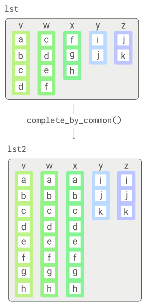

<!-- README.md is generated from README.Rmd. Please edit that file -->

# common

<!-- badges: start -->
<!-- badges: end -->

The goal of *common* is to detect common elements among vectors and
expand those vectors by adding elements from each other.

## Installation

You can install the current version of *common* with:

``` r
# install.packages("remotes")
remotes::install_github("ramiromagno/common")
```

## Motivation

I created this package to perform one specific task: to detect common
elements among vectors and complete those vectors by adding elements
from each other, in a sort of guilty by association fashion. Note that
the commonality is determined iteratively as new elements are added to
vectors.

## Example

Here is the visual example:



And the corresponding code:

``` r
library(common)

lst <- list(v = c('a', 'b', 'c', 'd'),
            w = c('c', 'd', 'e', 'f'),
            x = c('f', 'g', 'h'),
            y = c('i', 'j'),
            z = c('j', 'k')
            )

lst2 <- complete_by_common(lst)
lst2
#> $v
#> [1] "a" "b" "c" "d" "e" "f" "g" "h"
#> 
#> $w
#> [1] "a" "b" "c" "d" "e" "f" "g" "h"
#> 
#> $x
#> [1] "a" "b" "c" "d" "e" "f" "g" "h"
#> 
#> $y
#> [1] "i" "j" "k"
#> 
#> $z
#> [1] "i" "j" "k"
```

Note that while vectors `v` and `x` do not have any elements in common,
`v` and `w`, and `w` and `x` do, and thus after we expand `v` to include
elements from `w` (namely, `'f'`), then `v` and `x` also have common
elements and are expanded accordingly.
